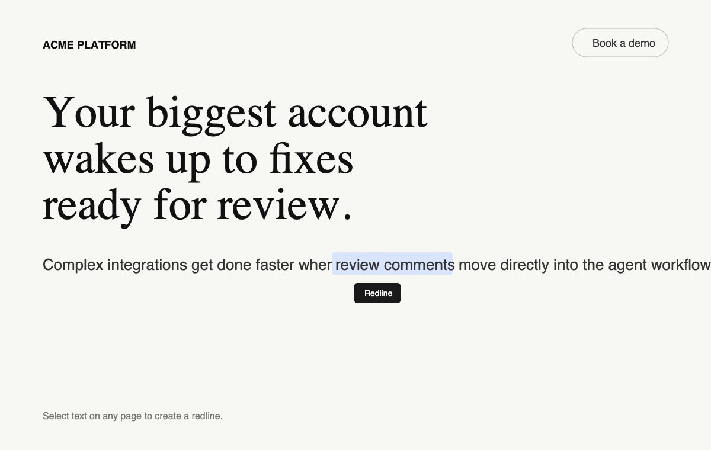
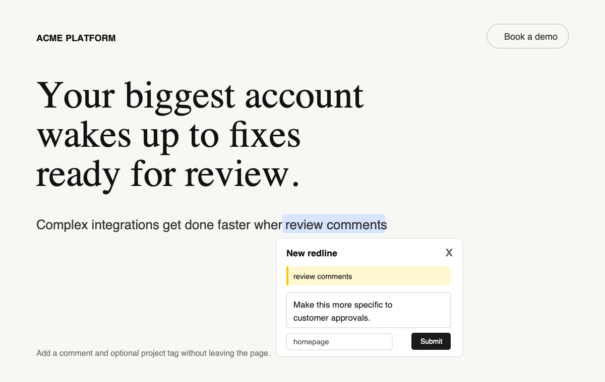
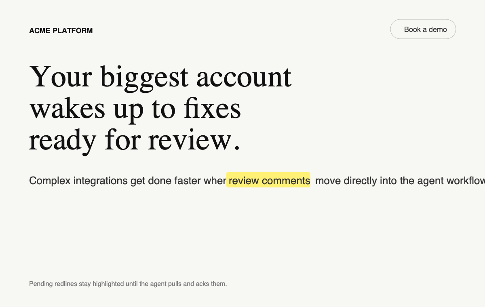
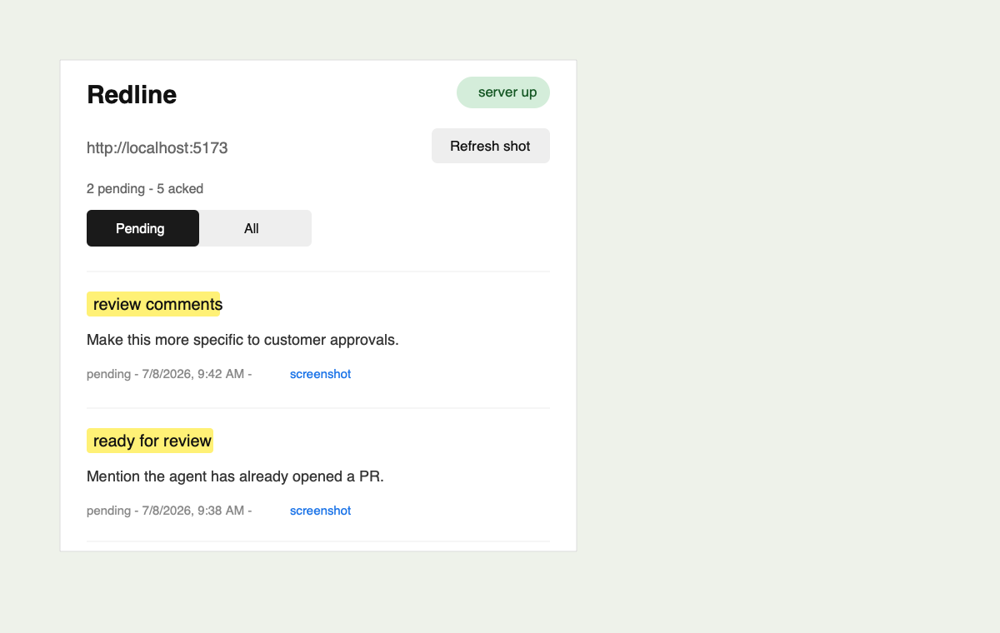
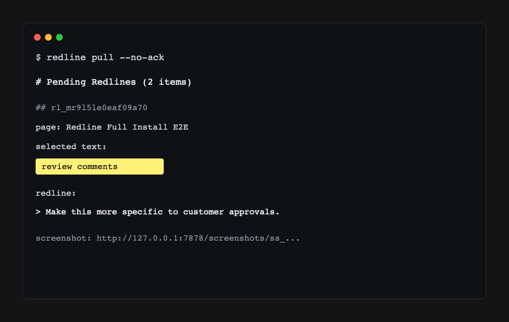

# Redline

[](https://www.npmjs.com/package/@archastro/redline)
[](https://github.com/ArchAstro/redline/actions/workflows/ci.yml)
[](LICENSE)

Highlight live web UI, leave redlines, pipe them into Claude Code or Codex.
Built and maintained by [ArchAstro](https://github.com/ArchAstro).

Three pieces: a Chrome extension for capturing redlines, a tiny local HTTP
sidecar that stores them, and an open agent skill that pulls them into your
session so the agent can act on the feedback.

```
[ Chrome extension ]  --POST-->  [ Sidecar @ 127.0.0.1:7878 ]  --GET-->  [ Coding agent ]
   select + comment                 ~/.redline/redlines.json                agent pull
```

## How It Works

Select text on a page and click **Redline**.



Add a comment without leaving the product surface.



Pending feedback stays highlighted until an agent pulls and acks it.



Use the extension popup to review pending feedback for the current origin.



Pull redlines into an agent workflow from the terminal or through the bundled
open agent skill.



---

## Install

Prerequisites: macOS or Linux, Node.js 18 or newer, Bash, curl, and jq, plus
Chrome or another Chromium-based browser. Redline's command-line helpers do
not currently support Windows. Your chosen agent-skill manager may have its
own requirements.

### Install the agent skill

Install the portable skill with the standard skills CLI:

```bash
npx skills add ArchAstro/redline
```

The skills CLI controls the installation scope, target agents, updates,
overwrite confirmation, provenance, and removal. Redline's CLI never installs,
updates, removes, or inspects agent skills or legacy plugin state.

### Recommended CLI install

Install the runtime once, then use the single `redline` command for extension
setup, status, and daily use. For the most useful experience, enable full
visual redlines so Redline works on normal websites and captures screenshots:

```bash
npm install -g @archastro/redline
redline setup --with-screenshots
redline start
redline status
```

`redline setup --with-screenshots` syncs the Chrome extension to
`~/.redline/extension` and creates an owner-only capability token used to
authenticate extension requests to the sidecar. It is idempotent; re-run
anytime to update. The command does not require an installed agent and does
not read or modify Claude Code, Codex, `.agents`, or skills CLI state.
The screenshot choice is saved in `~/.redline/config.json`, so future setup
runs keep the same mode until you change it.

Chrome may show broader site-access wording in this mode because screenshots
and non-local pages require broader extension access. If you prefer the
lowest-permission local-development mode, use:

```bash
redline setup --local-only
```

Flags:

- `--with-screenshots` — full visual mode for screenshots and any http/https page
- `--local-only` — low-permission mode for localhost-style pages
- `--uninstall` — remove the local synced Chrome extension only
- `--dry-run` — show what would change without writing

The package is published publicly as `@archastro/redline`.

### No global install

If you only want to run setup once without installing a global command:

```bash
npx --yes -p @archastro/redline redline setup --with-screenshots
```

The installed skill falls back to `npx --package @archastro/redline` when the
command-line helpers are not globally installed. For regular shell use, the
global CLI is smoother.

### Available commands

`npm install -g @archastro/redline` puts these binaries on PATH:

- `redline` — friendly wrapper for setup, status, sidecar, and pull commands
- `redline-agent-setup` — the setup CLI above
- `redline-extension-status` — check extension file sync, sidecar health, and Chrome reload steps
- `redline-sidecar` — start/stop/restart/status/logs the local daemon
- `redline-pull` — fetch pending redlines as markdown and ack them
- `redline-watch` — poll for new pending redlines
- `redline-tail` — dump everything in the store (debug)
- `redline-clear` — wipe the local store

Agent-skill status and lifecycle remain entirely under the skills CLI.

### Chrome extension

Redline currently supports Chrome and Chromium-based browsers. Load the
extension the standard way:

1. Open `chrome://extensions`
2. Toggle on **Developer mode** (top right)
3. Click **Load unpacked**
4. Pick `~/.redline/extension/`

From a repository checkout, run `node setup/redline.js setup` first so the
synced extension receives its local sidecar capability token and port. If you
set `REDLINE_DIR` or `REDLINE_PORT`, use the same environment when running setup,
status, and the sidecar.

Chrome does not let Redline auto-install or auto-reload the unpacked extension.
After setup, package updates, or a `git pull`, open `chrome://extensions` and
click **Reload** on the Redline card. Check your local state with:

```bash
redline status
# or: redline-extension-status
```

---

## Use

Ask your agent: **"Pull my redlines."** The standard `redline` skill is
installed for each supported agent:

| Surface | Invocation |
| ------- | ---------- |
| Portable prompt | `"Pull my redlines."` |
| Agent skill | `redline` |
| Terminal | `redline pull` |

1. **Start the sidecar** (idempotent, detaches in the background, exits
   immediately once `/health` responds):

   ```bash
   redline start
   ```

   PID lives at `~/.redline/sidecar.pid` and survives across sessions.

2. **On any page where the extension is allowed to run**: select some text. A
   small **Redline** button appears near the selection. Click it, write your
   comment, optionally tag the project, submit. The selection turns yellow
   (CSS Custom Highlight API — no DOM mutation). Click an existing highlight
   to edit or delete.

   In `--with-screenshots` mode, a screenshot of the visible page is captured
   on the **first** submit per page-load and reused for all subsequent redlines
   on that page. Use the **Refresh shot** button in the toolbar popup to force
   a new snapshot if the page state changes.

3. **Pull the redlines** with the portable prompt or the invocation for your
   surface. The bundled skill runs `redline-pull --no-ack` and finds the source
   code for each item by grepping for the literal selected text. Straightforward,
   low-risk redlines are applied and verified automatically. Ambiguous,
   destructive, or broad changes require clarification before editing.

   Or run it directly:

   ```bash
   redline pull                       # all pending, all origins, acks each
   redline pull https://localhost:5173 # filter by origin
   redline pull --project my-app
   redline pull --no-ack              # peek without consuming
   ```

---

## Configuration

| Env var          | Default          | What it sets                       |
| ---------------- | ---------------- | ---------------------------------- |
| `REDLINE_PORT`   | `7878`           | Sidecar HTTP port                  |
| `REDLINE_DIR`    | `~/.redline`     | Sidecar data dir (DB, screenshots, and auth token) |

Data layout in `$REDLINE_DIR`:

```
~/.redline/
├── redlines.json          # the full store (pending + acked)
├── screenshots/<id>.png   # per-page screenshots
├── auth-token             # owner-only extension capability token
├── sidecar.pid            # daemon PID
└── sidecar.log            # daemon log
```

---

## Architecture

### Sidecar API

Loopback-only HTTP. Browser-originated requests are accepted only from Chrome
extension origins; command-line tools without an `Origin` header can access
the sidecar locally.

| Method | Path                       | What it does                            |
| ------ | -------------------------- | --------------------------------------- |
| GET    | `/health`                  | server up check                         |
| POST   | `/redlines`                | create a redline                        |
| GET    | `/redlines`                | list, filterable by `status`, `origin`, `project` |
| PATCH  | `/redlines/:id`            | update a redline without changing its id |
| POST   | `/redlines/:id/ack`        | mark as consumed                        |
| DELETE | `/redlines/:id`            | hard-delete                             |
| POST   | `/screenshots`             | upload a screenshot (JSON `data_url`)   |
| GET    | `/screenshots/:id`         | fetch as raw PNG                        |

Items survive after ack with `status=acked` for audit. The `redline-pull`
flow explicitly acks after delivering — if your Claude session dies
mid-pull, the items stay pending.

### Redline shape

```json
{
  "id": "rl_01HX...",
  "created_at": "2026-05-26T18:32:11Z",
  "status": "pending",
  "url": "http://localhost:5173/dashboard",
  "origin": "http://localhost:5173",
  "title": "Dashboard · MyApp",
  "project": "my-app",
  "selected_text": "Get started with your first agent",
  "comment": "should say 'Deploy your first agent'",
  "context": {
    "selector": "main > section.hero > h1",
    "surrounding_text": "...header... Get started with your first agent ...subheader...",
    "html_snippet": "<h1>Get started with your first agent</h1>",
    "viewport": { "w": 1440, "h": 900 },
    "range_ref": { "startSelector": "...", "startOffset": 0, "endSelector": "...", "endOffset": 33, "text": "Get started with your first agent" }
  },
  "rect": { "x": 240, "y": 180, "w": 520, "h": 48 },
  "screenshot_id": "ss_01HABC..."
}
```

The `selected_text` literal is the most reliable locator — Claude greps the
repo for it and uses `surrounding_text` to disambiguate. CSS selectors are
included but best-effort and brittle across SPA renders.

### Privacy and local data

Redline stores data locally under `$REDLINE_DIR` (`~/.redline` by default).
Redlines can include selected text, comments, page URLs, page titles, DOM
snippets, and screenshots. Treat that directory as developer data; do not share
it publicly unless you have reviewed its contents.

The sidecar listens on `127.0.0.1` only. Browser-originated requests require both
a Chrome extension origin and the capability token generated by `redline setup`;
ordinary web pages and unrelated extensions cannot read or write redlines.
Command-line tools without an `Origin` header can access the sidecar locally.

`redline setup --with-screenshots` gives the unpacked extension broader
http/https page access so it can inject on normal websites and capture visible
page screenshots. Use `redline setup --local-only` if you only want the
lower-permission localhost workflow.

### Known v1 limits

- Chrome/Chromium only. Safari and Firefox are not supported yet.
- Unpacked extension loading is manual. Chrome may disable an unpacked extension
  or keep an old copy loaded until you revisit `chrome://extensions` and reload
  Redline.
- `redline setup --local-only` limits auto-injection to `localhost`,
  `127.0.0.1`, and `*.localhost`. Use `redline setup --with-screenshots` for
  normal http/https websites and reliable screenshot capture.
- Top-frame only — no iframe or shadow-DOM support.
- Highlight restoration on reload is best-effort (CSS path + offsets); pages
  whose markup shifts between loads will drop stale ones silently when Redline
  can tell the original text no longer matches.
- Acking a redline from the CLI does not live-update an already-open page. A
  reload reconciles visible markers with pending sidecar items when the sidecar
  is reachable.
- Screenshot cache is keyed `(tabId, url)`; changing route in the same tab
  invalidates.
- Pull-only — agents poll; no push/SSE.

---

## Development

```bash
git clone https://github.com/ArchAstro/redline.git
cd redline
npm install
npm test
npm run check:syntax
```

### Troubleshooting

**The Redline button does not appear after restarting Chrome**

Run:

```bash
redline status
```

If the extension files are missing or out of sync, run
`redline setup --with-screenshots` for full visual redlines, or
`redline setup --local-only` for the narrower local-development mode.
Then open `chrome://extensions`, enable Developer mode, find Redline, and click
**Reload**. Confirm the Redline card points at the extension directory you
expect, usually `~/.redline/extension` after setup.

If the sidecar is down, start it:

```bash
redline start
```

### Releasing

This repo uses [changesets](https://github.com/changesets/changesets). To ship
a release:

```bash
npx changeset            # interactive: pick bump type, write the changelog line
git add .changeset/*.md
git commit -m "feat: ..."
git push                 # opens a 'chore: version packages' PR via CI
```

When the version-packages PR merges to `main`, the
[`release.yml`](.github/workflows/release.yml) workflow runs
`npx changeset publish` and pushes the new version to npm.
The workflow requests GitHub OIDC (`id-token: write`) and sets
`NPM_CONFIG_PROVENANCE=true` so npm can attach provenance when the package is
published from GitHub Actions. Configure npm Trusted Publishing for this
repository/package before removing `NPM_TOKEN`.

To publish manually without the PR dance (needs `NODE_AUTH_TOKEN`):

```bash
npx changeset
npm run version
npm run release
```

### Layout

```
redline/
├── .changeset/{config.json, README.md}
├── .github/workflows/release.yml
├── package.json                      # @archastro/redline
├── extension/                        # Chrome MV3 extension
│   ├── manifest.json
│   ├── content.{js,css}              # selection UI, highlight rendering
│   ├── background.js                 # screenshot cache + HTTP client
│   └── popup.{html,js}               # toolbar list view
├── runtime/
│   ├── bin/
│   │   ├── redline-sidecar
│   │   ├── redline-pull
│   │   ├── redline-watch
│   │   ├── redline-tail
│   │   └── redline-clear
│   └── server.js                     # Node stdlib HTTP sidecar
└── skills/redline/SKILL.md           # portable open agent skill
```
